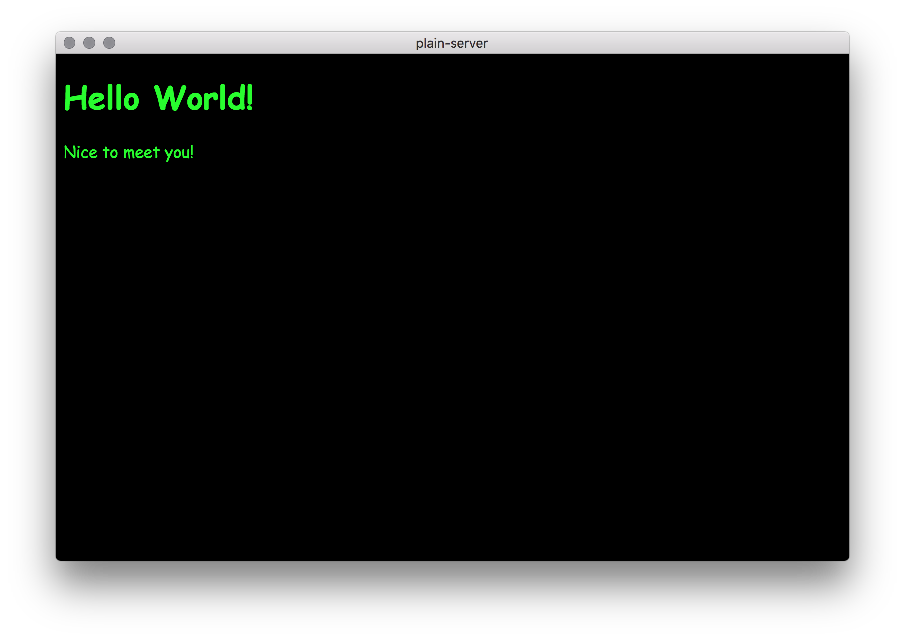
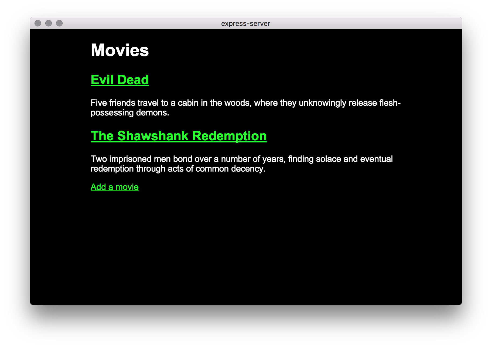
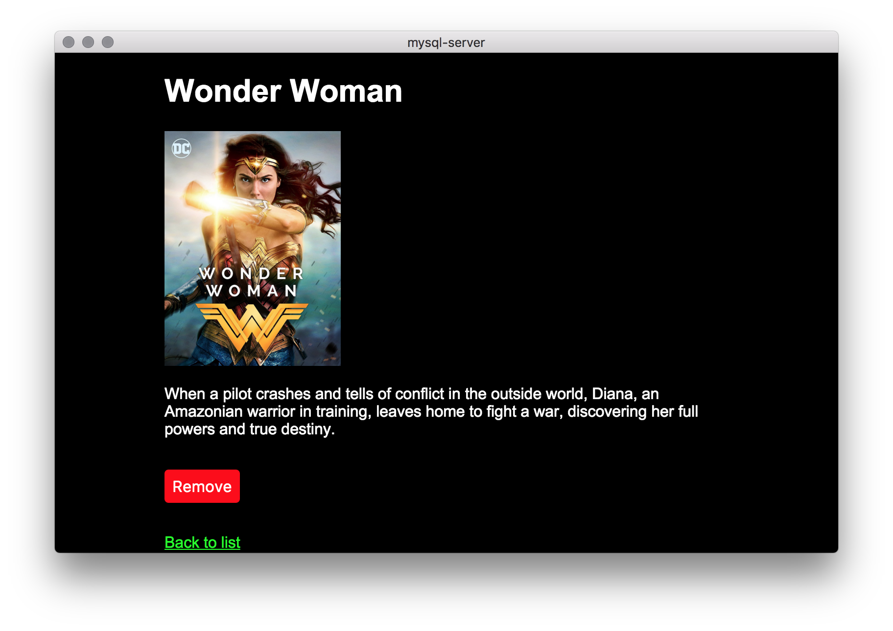

# Examples

Below is a list of substantial examples found in the slides of lectures and
labs.

## Plain Server

[][plain-server]

*   **Example**: [`plain-server`][plain-server]
*   **Class**: [Lecture 3](../week-3.md#lecture)
*   **Topics**: Routing, status codes, mime types, serving static files,
    all without npm packages or frameworks

## Express Server

[][express-server]

*   **Example**: [`express-server`][express-server]
*   **Class**: [Lecture 4](../week-4.md#lecture)
*   **Topics**: Routes, not found, serving static files, render data with
    templates, post data with forms, upload images, delete things with XHR

## MySQL Server

[][mysql-server]

*   **Example**: [`mysql-server`][mysql-server]
*   **Class**: [Lecture 5](../week-5.md#lecture)
*   **Topics**: Database, Express, dotenv, MySQL, SQL (select, insert, delete)

[plain-server]: plain-server#readme

[express-server]: express-server#readme

[mysql-server]: mysql-server#readme
